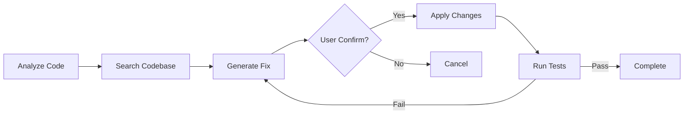

# Sidekick v0.8.7 Changelog — Agent Orchestration

> **Release Date:** 2026-02-06  
> **Phase:** LLM Integration (v0.8.x)

---

## Summary

This release adds **Agent Orchestration** — multi-step workflows and autonomous mode for the agent.

---

## New Features

### 🔄 Workflow Actions (15 types)

| Action | Description | Modifies Code |
|--------|-------------|---------------|
| `ASK_USER` | Wait for user input/confirmation | ❌ |
| `ANALYZE_CODE` | Analyze code for context | ❌ |
| `GENERATE_CODE` | Generate new code | ❌ |
| `RUN_TESTS` | Run tests | ❌ |
| `APPLY_CHANGES` | Apply changes to files | ✅ |
| `SEARCH_CODEBASE` | Search the codebase | ❌ |
| `CREATE_FILE` | Create a new file | ✅ |
| `MODIFY_FILE` | Modify existing file | ✅ |
| `COMMIT_CHANGES` | Commit to git | ✅ |
| `RUN_COMMAND` | Run shell command | ❌ |
| `WAIT` | Wait for condition | ❌ |
| `BRANCH` | Branch based on condition | ❌ |
| `SET_VARIABLE` | Set workflow variable | ❌ |
| `LOG` | Log a message | ❌ |
| `NOTIFY` | Send notification | ❌ |

### ⚡ Trigger Types (7 types)

| Trigger | Description |
|---------|-------------|
| `MANUAL` | User-initiated |
| `FILE_SAVE` | On file save (pattern matching) |
| `ERROR_DETECTED` | On compilation/runtime error |
| `COMMAND` | Via command/shortcut |
| `SCHEDULE` | On schedule |
| `WEBHOOK` | External webhook |
| `GIT_HOOK` | Git hooks (pre-commit, etc.) |

### 📋 Built-in Workflows (6)

| Workflow | Description | Steps |
|----------|-------------|-------|
| `fix-error` | Fix compilation/runtime error | 6 |
| `implement-feature` | Implement new feature | 7 |
| `refactor-code` | Refactor for quality | 5 |
| `add-tests` | Generate tests for code | 5 |
| `code-review` | Review and suggest improvements | 3 |
| `document-code` | Generate documentation | 4 |

---

## Components Added

### Models (`WorkflowModels.kt`)

| Type | Description |
|------|-------------|
| `AgentWorkflow` | Workflow definition |
| `WorkflowStep` | Single step in workflow |
| `WorkflowAction` | 15 action types |
| `WorkflowTrigger` | Trigger definition |
| `TriggerType` | 7 trigger types |
| `WorkflowConfig` | Workflow configuration |
| `WorkflowContext` | Runtime context |
| `StepResult` | Step execution result |
| `WorkflowRun` | Workflow execution instance |
| `WorkflowEvent` | Execution events |
| `StepCondition` | Conditional execution |
| `BuiltInWorkflows` | 6 built-in workflows |

### Executor (`WorkflowExecutor.kt`)

| Method | Description |
|--------|-------------|
| `registerWorkflow()` | Register a workflow |
| `startWorkflow()` | Start workflow execution |
| `executeNextStep()` | Execute next step |
| `executeUntilComplete()` | Run until done/user input |
| `continueAfterUserInput()` | Continue after user responds |
| `pauseWorkflow()` | Pause running workflow |
| `resumeWorkflow()` | Resume paused workflow |
| `cancelWorkflow()` | Cancel running workflow |
| `processTrigger()` | Process trigger event |
| `getStats()` | Get execution statistics |

---

## Files Changed

### New Files
- `src/main/kotlin/com/sidekick/agent/workflow/WorkflowModels.kt`
- `src/main/kotlin/com/sidekick/agent/workflow/WorkflowExecutor.kt`
- `src/test/kotlin/com/sidekick/agent/workflow/WorkflowModelsTest.kt`
- `src/test/kotlin/com/sidekick/agent/workflow/WorkflowExecutorTest.kt`

---

## Test Coverage

| Test Class | Tests | Coverage |
|------------|-------|----------|
| `WorkflowModelsTest` | 35+ | Workflows, steps, triggers, context |
| `WorkflowExecutorTest` | 35+ | Registration, execution, control |

---

## API Reference

### Define Workflow
```kotlin
val myWorkflow = AgentWorkflow(
    id = "my-workflow",
    name = "My Workflow",
    description = "Does something useful",
    steps = listOf(
        WorkflowStep("1", WorkflowAction.ANALYZE_CODE, mapOf("focus" to "errors"), onSuccess = "2"),
        WorkflowStep("2", WorkflowAction.GENERATE_CODE, mapOf("type" to "fix"), onSuccess = "3"),
        WorkflowStep("3", WorkflowAction.ASK_USER, mapOf("confirm" to true), onSuccess = "4"),
        WorkflowStep("4", WorkflowAction.APPLY_CHANGES)
    ),
    triggers = listOf(WorkflowTrigger(TriggerType.MANUAL))
)
```

### Execute Workflow
```kotlin
val executor = WorkflowExecutor(project.basePath ?: "")

// Register custom workflow
executor.registerWorkflow(myWorkflow)

// Start workflow
val run = executor.startWorkflow("my-workflow", mapOf("mode" to "debug"))

// Execute until user interaction needed
executor.executeUntilComplete(run.id)

// Handle user interaction
if (executor.getActiveRun(run.id)?.status == WorkflowStatus.WAITING_USER) {
    executor.continueAfterUserInput(run.id, proceed = true)
}
```

### Process Triggers
```kotlin
// Process error detection trigger
val event = TriggerEvent(TriggerType.ERROR_DETECTED, "NullPointerException")
val runs = executor.processTrigger(event)
```

### Listen for Events
```kotlin
executor.addListener { event ->
    when (event) {
        is WorkflowEvent.WorkflowStarted -> println("Started: ${event.workflowName}")
        is WorkflowEvent.StepCompleted -> println("Step done: ${event.stepId}")
        is WorkflowEvent.WorkflowCompleted -> println("Completed in ${event.durationMs}ms")
        is WorkflowEvent.WorkflowFailed -> println("Failed: ${event.error}")
        else -> {}
    }
}
```

---

## Built-in Workflow: Fix Error



---

## Verification

```bash
./gradlew test --tests "com.sidekick.agent.workflow.*"
# All tests passing
```
