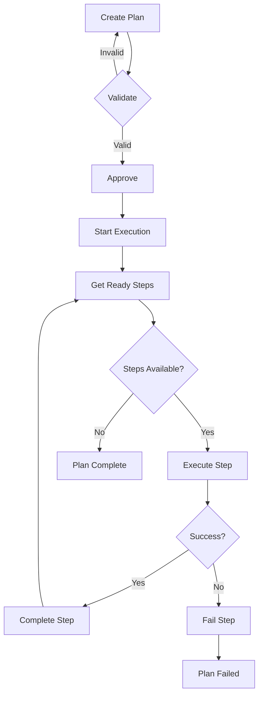

# Sidekick v0.9.1 Changelog — Planning Agent

> **Release Date:** 2026-02-06  
> **Phase:** Advanced Agent Capabilities (v0.9.x)

---

## Summary

This release adds **Planning Agent** — task decomposition and strategic planning for the agent.

---

## New Features

### 📊 Problem Analysis

| Dimension | Values |
|-----------|--------|
| **Scope** | Single File, Multi-File, Module, Cross-Module, Project-Wide |
| **Complexity** | Trivial, Simple, Moderate, Complex, Very Complex |

### 🎯 Plan Strategies

| Approach | Description |
|----------|-------------|
| `INCREMENTAL` | Small changes with verification at each step |
| `BIG_BANG` | Complete implementation before testing |
| `SPIKE_FIRST` | Quick prototype to understand, then clean implementation |
| `TEST_FIRST` | Write tests before implementation (TDD) |
| `PARALLEL` | Multiple independent work streams |

### 📋 Step Types (8)

| Type | Icon | Description |
|------|------|-------------|
| Research | 🔍 | Gather information |
| Design | 📐 | Architecture decisions |
| Implement | 💻 | Write code |
| Test | 🧪 | Write/run tests |
| Refactor | ♻️ | Improve code |
| Document | 📝 | Documentation |
| Verify | ✅ | Validate results |
| Cleanup | 🧹 | Clean up |

### ⚠️ Risk Levels

| Level | Score Range |
|-------|-------------|
| Low | < 1.0 |
| Medium | 1.0 - 2.0 |
| High | 2.0 - 3.0 |
| Critical | ≥ 3.0 |

---

## Components Added

### Models (`PlanningModels.kt`)

| Type | Description |
|------|-------------|
| `TaskPlan` | Complete plan with steps, dependencies, risks |
| `ProblemAnalysis` | Scope, complexity, constraints |
| `PlanStrategy` | Approach with alternatives |
| `PlanStep` | Individual step with verification |
| `EffortEstimate` | Time/token estimates |
| `PlanRisk` | Risk with mitigation |
| `PlanEvent` | Lifecycle events |
| `PlanningContext` | Project context |

### Service (`PlanningService.kt`)

| Method | Description |
|--------|-------------|
| `createPlan()` | Create plan with LLM |
| `createSimplePlan()` | Create linear plan |
| `createDetailedPlan()` | Create with full spec |
| `approvePlan()` | Approve for execution |
| `startPlan()` | Begin execution |
| `startNextStep()` | Start ready step |
| `completeStep()` | Mark step complete |
| `failStep()` | Mark step failed |
| `refinePlan()` | Refine with feedback |
| `analyzeGoal()` | Analyze problem space |
| `suggestStrategy()` | Recommend strategy |

---

## Files Changed

### New Files
- `src/main/kotlin/com/sidekick/agent/planning/PlanningModels.kt`
- `src/main/kotlin/com/sidekick/agent/planning/PlanningService.kt`
- `src/test/kotlin/com/sidekick/agent/planning/PlanningModelsTest.kt`
- `src/test/kotlin/com/sidekick/agent/planning/PlanningServiceTest.kt`

---

## Test Coverage

| Test Class | Tests | Coverage |
|------------|-------|----------|
| `PlanningModelsTest` | 30+ | Plans, analysis, strategy, steps, risks |
| `PlanningServiceTest` | 30+ | Creation, lifecycle, execution, events |

---

## API Reference

### Create a Plan
```kotlin
val service = PlanningService(project.basePath ?: "")

// Simple linear plan
val plan = service.createSimplePlan(
    goal = "Add user authentication",
    stepDescriptions = listOf(
        "Research OAuth2 libraries",
        "Design auth flow",
        "Implement login endpoint",
        "Add session management",
        "Write integration tests"
    )
)

// Detailed plan with analysis
val detailed = service.createDetailedPlan(
    goal = "Refactor payment module",
    analysis = ProblemAnalysis(
        scope = Scope.MODULE,
        complexity = Complexity.COMPLEX,
        affectedAreas = listOf("payment", "billing", "subscriptions"),
        constraints = listOf("Maintain backward compatibility"),
        unknowns = listOf("Third-party API rate limits")
    ),
    strategy = PlanStrategy(
        approach = Approach.INCREMENTAL,
        reasoning = "Large scope requires careful incremental changes"
    ),
    steps = listOf(
        PlanStep("1", 1, "Analyze", "analyze current structure", StepType.RESEARCH, verificationCriteria = "Doc written"),
        PlanStep("2", 2, "Refactor", "refactor core module", StepType.REFACTOR, verificationCriteria = "Tests pass")
    ),
    risks = listOf(
        PlanRisk.medium("API changes", "Add version check")
    )
)
```

### Execute a Plan
```kotlin
// Start execution
service.approvePlan(plan.id)
service.startPlan(plan.id)

// Execute steps
while (service.getActivePlan() != null) {
    val step = service.startNextStep(plan.id)
    if (step != null) {
        // Execute step...
        service.completeStep(plan.id, step.id, "Output")
    }
}
```

### Listen for Events
```kotlin
service.addListener { event ->
    when (event) {
        is PlanEvent.PlanCreated -> println("Plan created: ${event.goal}")
        is PlanEvent.StepStarted -> println("Starting: ${event.stepTitle}")
        is PlanEvent.StepCompleted -> println("Done: ${event.stepId}")
        is PlanEvent.PlanCompleted -> println("Plan complete in ${event.durationMs}ms")
        else -> {}
    }
}
```

---

## Plan Execution Flow



---

## Verification

```bash
./gradlew test --tests "com.sidekick.agent.planning.*"
# All tests passing
```
