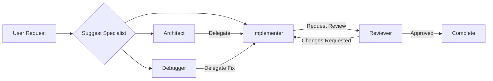

# Sidekick v0.9.2 Changelog — Specialist Agents

> **Release Date:** 2026-02-06  
> **Phase:** Advanced Agent Capabilities (v0.9.x)

---

## Summary

This release adds **Specialist Agents** — role-based sub-agents with focused expertise.

---

## New Features

### 🎭 Agent Roles (8)

| Role | Icon | Focus |
|------|------|-------|
| **Architect** | 🏗️ | System design, patterns, module boundaries |
| **Implementer** | ⚙️ | Writing clean, idiomatic code |
| **Reviewer** | 👁️ | Code quality, correctness, best practices |
| **Tester** | 🧪 | Tests, coverage, edge cases |
| **Documenter** | 📝 | Documentation, comments, examples |
| **Debugger** | 🐛 | Root cause analysis, minimal fixes |
| **Optimizer** | ⚡ | Performance, efficiency, algorithms |
| **Security** | 🔒 | Vulnerabilities, auth, secure coding |

### 🔧 Capabilities (11)

| Capability | Description |
|------------|-------------|
| `READ_CODE` | Read source files |
| `WRITE_CODE` | Modify existing files |
| `CREATE_FILES` | Create new files |
| `DELETE_FILES` | Remove files |
| `RUN_TESTS` | Execute tests |
| `ANALYZE_AST` | Parse code structure |
| `SEARCH_CODEBASE` | Search files and symbols |
| `EXECUTE_COMMANDS` | Run shell commands |
| `MODIFY_CONFIG` | Change config files |
| `ACCESS_MEMORY` | Access conversation memory |
| `DELEGATE_TASKS` | Assign to other agents |

### 📋 Response Features

- **Confidence scoring** — 0-1 confidence in response
- **Suggested actions** — Follow-up recommendations with priority
- **Artifacts** — Code, documentation, reviews, decisions
- **Delegation** — Suggest handoff to other specialists
- **Review feedback** — Structured review items with severity

---

## Components Added

### Models (`SpecialistModels.kt`)

| Type | Description |
|------|-------------|
| `SpecialistAgent` | Agent with role, prompt, capabilities |
| `AgentRole` | 8 specialist roles |
| `Capability` | 11 agent capabilities |
| `SpecialistRequest` | Request with prompt, context, files |
| `AgentResponse` | Response with content, confidence, actions |
| `SuggestedAction` | Follow-up action recommendation |
| `ResponseArtifact` | Generated code, docs, reviews |
| `ReviewFeedback` | Structured review with items |
| `SpecialistEvent` | Lifecycle events |

### Prompts (`SpecialistPrompts.kt`)

| Method | Description |
|--------|-------------|
| `forRole()` | Get prompt for role |
| `all()` | Get all prompts |
| `withProjectContext()` | Add project context |
| `withCollaboration()` | Add collaborator info |
| `forTask()` | Add task-specific focus |

### Service (`SpecialistService.kt`)

| Method | Description |
|--------|-------------|
| `getSpecialist()` | Get agent by role |
| `invoke()` | Invoke with prompt |
| `invokeChain()` | Sequential invocation |
| `invokeParallel()` | Parallel invocation |
| `delegate()` | Delegate between agents |
| `suggestSpecialist()` | Recommend agent for task |
| `implementReviewLoop()` | Implement-review cycle |

---

## Files Changed

### New Files
- `src/main/kotlin/com/sidekick/agent/specialists/SpecialistModels.kt`
- `src/main/kotlin/com/sidekick/agent/specialists/SpecialistPrompts.kt`
- `src/main/kotlin/com/sidekick/agent/specialists/SpecialistService.kt`
- `src/test/kotlin/com/sidekick/agent/specialists/SpecialistModelsTest.kt`
- `src/test/kotlin/com/sidekick/agent/specialists/SpecialistPromptsTest.kt`
- `src/test/kotlin/com/sidekick/agent/specialists/SpecialistServiceTest.kt`

---

## Test Coverage

| Test Class | Tests | Coverage |
|------------|-------|----------|
| `SpecialistModelsTest` | 25+ | Agents, roles, capabilities, responses |
| `SpecialistPromptsTest` | 15+ | Prompts, retrieval, customization |
| `SpecialistServiceTest` | 25+ | Invocation, delegation, events |

---

## API Reference

### Invoke a Specialist
```kotlin
val service = SpecialistService(project.basePath ?: "")

// Simple invocation
val response = service.invoke(
    role = AgentRole.ARCHITECT,
    prompt = "Design a caching layer for the API",
    context = existingCode
)

println("Confidence: ${response.confidence}")
response.suggestedActions.forEach { action ->
    println("${action.priority}: ${action.description}")
}
```

### Chain Multiple Specialists
```kotlin
// Sequential: Architect → Implementer → Tester
val responses = service.invokeChain(
    roles = listOf(AgentRole.ARCHITECT, AgentRole.IMPLEMENTER, AgentRole.TESTER),
    initialPrompt = "Add user authentication feature"
)

responses.forEach { response ->
    println("${response.role.displayName}: ${response.content.take(100)}...")
}
```

### Implement-Review Loop
```kotlin
// Automatically iterate until approved
val result = service.implementReviewLoop(
    prompt = "Implement a binary search function",
    maxIterations = 3
)

if (result.approved) {
    println("Approved after ${result.iterations} iterations")
    println(result.finalContent)
} else {
    println("Not approved, feedback: ${result.feedback?.overallAssessment}")
}
```

### Suggest Specialist for Task
```kotlin
val role = service.suggestSpecialist("fix the null pointer exception in login")
// Returns: AgentRole.DEBUGGER

val specialist = service.getSpecialist(role)
println("${specialist.displayName} will handle this")
```

### Custom Specialist
```kotlin
val custom = service.createCustomSpecialist(
    role = AgentRole.IMPLEMENTER,
    customPrompt = "You are a Kotlin expert focused on coroutines...",
    additionalCapabilities = setOf(Capability.EXECUTE_COMMANDS),
    temperature = 0.3f
)
```

---

## Role Capabilities Matrix

| Role | Read | Write | Test | AST | Search | Commands | Delegate |
|------|------|-------|------|-----|--------|----------|----------|
| Architect | ✅ | ❌ | ❌ | ✅ | ✅ | ❌ | ✅ |
| Implementer | ✅ | ✅ | ❌ | ❌ | ✅ | ❌ | ❌ |
| Reviewer | ✅ | ❌ | ❌ | ✅ | ✅ | ❌ | ❌ |
| Tester | ✅ | ✅ | ✅ | ❌ | ❌ | ❌ | ❌ |
| Documenter | ✅ | ✅ | ❌ | ❌ | ❌ | ❌ | ❌ |
| Debugger | ✅ | ❌ | ❌ | ✅ | ✅ | ✅ | ❌ |
| Optimizer | ✅ | ✅ | ✅ | ✅ | ❌ | ❌ | ❌ |
| Security | ✅ | ❌ | ❌ | ✅ | ✅ | ❌ | ❌ |

---

## Delegation Flow



---

## Verification

```bash
./gradlew test --tests "com.sidekick.agent.specialists.*"
# All tests passing
```
