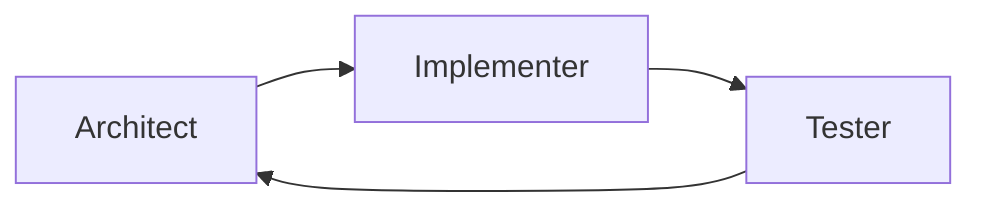
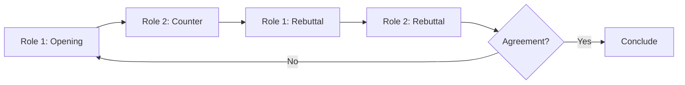
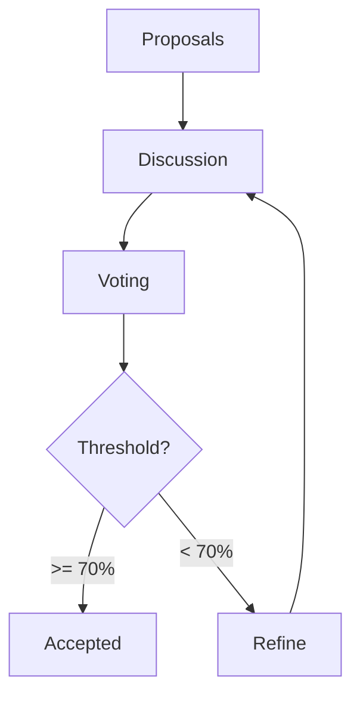

# Sidekick v0.9.3 Changelog — Agent Collaboration

> **Release Date:** 2026-02-06  
> **Phase:** Advanced Agent Capabilities (v0.9.x)

---

## Summary

This release adds **Agent Collaboration** — multi-agent coordination with sessions, protocols, and shared context.

---

## New Features

### 🤝 Collaboration Sessions

Sessions coordinate multiple specialist agents working together:

| Field | Description |
|-------|-------------|
| `name` | Human-readable session name |
| `goal` | Objective of this collaboration |
| `participants` | Agents participating |
| `protocol` | Coordination protocol |
| `sharedContext` | Shared artifacts, facts, decisions |
| `messages` | Message history |

### 📋 Session Status (8)

| Status | Description |
|--------|-------------|
| `CREATED` | Session created, not started |
| `ACTIVE` | Session running |
| `PAUSED` | Temporarily paused |
| `WAITING_FOR_USER` | Awaiting user input |
| `CONSENSUS_REACHED` | Agreement achieved |
| `COMPLETED` | Successfully finished |
| `CANCELLED` | Cancelled |
| `FAILED` | Session failed |

### 🔄 Coordination Protocols (7)

| Protocol | Description |
|----------|-------------|
| `ROUND_ROBIN` | Agents take turns sequentially |
| `BROADCAST` | All agents respond in parallel |
| `FREE_FORM` | Agents respond dynamically |
| `DEBATE` | Two agents argue viewpoints |
| `CONSENSUS` | Work toward agreement |
| `LEADER_FOLLOWER` | One agent leads, others follow |
| `VOTING` | Agents vote on proposals |

### 💬 Message Types (11)

| Type | Description |
|------|-------------|
| `CONTRIBUTION` | General contribution |
| `QUESTION` | Question to participant |
| `ANSWER` | Reply to question |
| `PROPOSAL` | Proposal for consideration |
| `VOTE` | Vote on proposal |
| `CRITIQUE` | Critique of contribution |
| `AGREEMENT` | Agreement statement |
| `DELEGATION_REQUEST` | Suggest delegation |
| `SUMMARY` | Session summary |
| `DECISION` | Final decision |
| `SYSTEM` | System message |

---

## Components Added

### Models (`CollaborationModels.kt`)

| Type | Description |
|------|-------------|
| `CollaborationSession` | Session with participants, protocol, context |
| `SessionStatus` | 8 session statuses |
| `Participant` | Agent in session with status, message count |
| `ParticipantStatus` | Ready, Thinking, Responded, Blocked, Exited |
| `CollaborationProtocol` | 7 coordination protocols |
| `CollaborationMessage` | Message with type, content, attachments |
| `MessageType` | 11 message types |
| `MessageAttachment` | Code, document, diagram attachments |
| `SharedContext` | Shared artifacts, facts, decisions, questions |
| `Decision` | Decision with rationale |
| `ConsensusState` | Tracks votes on proposals |
| `Vote` | Individual vote with reason |
| `CollaborationEvent` | Session lifecycle events |
| `CollaborationResult` | Session outcome with stats |

### Orchestrator (`CollaborationOrchestrator.kt`)

| Method | Description |
|--------|-------------|
| `createSession()` | Create with roles and protocol |
| `createDebate()` | Two-agent debate session |
| `createReview()` | Implementer-Reviewer session |
| `startSession()` | Activate session |
| `pauseSession()` / `resumeSession()` | Session control |
| `endSession()` | Complete with result |
| `executeTurn()` | Execute single turn |
| `runRound()` | Execute all participants |
| `runUntil()` | Run until condition |
| `executeSession()` | Full protocol execution |
| `sendMessage()` | Send message to session |
| `recordDecision()` | Record a decision |
| `recordVote()` | Record consensus vote |
| `addArtifact()` / `addFact()` | Update shared context |

---

## Files Changed

### New Files
- `src/main/kotlin/com/sidekick/agent/collaboration/CollaborationModels.kt`
- `src/main/kotlin/com/sidekick/agent/collaboration/CollaborationOrchestrator.kt`
- `src/test/kotlin/com/sidekick/agent/collaboration/CollaborationModelsTest.kt`
- `src/test/kotlin/com/sidekick/agent/collaboration/CollaborationOrchestratorTest.kt`

---

## Test Coverage

| Test Class | Tests | Coverage |
|------------|-------|----------|
| `CollaborationModelsTest` | 30+ | Sessions, messages, context, consensus |
| `CollaborationOrchestratorTest` | 30+ | Lifecycle, turns, protocols, events |

---

## API Reference

### Create and Execute a Session
```kotlin
val orchestrator = CollaborationOrchestrator()

// Create a session with 3 specialists
val session = orchestrator.createSession(
    name = "Feature Implementation",
    goal = "Design and implement user authentication",
    roles = listOf(AgentRole.ARCHITECT, AgentRole.IMPLEMENTER, AgentRole.TESTER),
    protocol = CollaborationProtocol.ROUND_ROBIN
)

// Execute the full session (3 rounds)
val result = orchestrator.executeSession(session.id, maxRounds = 3)

println("Success: ${result.success}")
println("Messages: ${result.messageCount}")
println("Decisions: ${result.decisions.size}")
```

### Debate Between Specialists
```kotlin
// Create a debate on a design decision
val debate = orchestrator.createDebate(
    goal = "Should we use microservices or monolith?",
    role1 = AgentRole.ARCHITECT,
    role2 = AgentRole.OPTIMIZER
)

val result = orchestrator.executeSession(debate.id, maxRounds = 4)

// Check the outcome
result.decisions.forEach { decision ->
    println("${decision.madeBy.displayName}: ${decision.description}")
}
```

### Manual Turn Control
```kotlin
val session = orchestrator.createSession(
    "Code Review",
    "Review authentication module",
    listOf(AgentRole.IMPLEMENTER, AgentRole.REVIEWER)
)
orchestrator.startSession(session.id)

// Execute turns manually
while (true) {
    val result = orchestrator.executeTurn(session.id)
    if (!result.success) break

    println("${result.message?.senderRole?.displayName}: ${result.message?.content?.take(100)}")

    // Check for consensus or max turns
    val current = orchestrator.getSession(session.id)
    if (current?.hasReachedMaxTurns == true) break
}
```

### Shared Context
```kotlin
val session = orchestrator.createSession("Collab", "Goal", roles)
orchestrator.startSession(session.id)

// Add shared artifacts
orchestrator.addArtifact(session.id, "api.kt", """
    interface AuthService {
        fun login(user: String, password: String): Token
    }
""".trimIndent())

// Add established facts
orchestrator.addFact(session.id, "We're using JWT for tokens")
orchestrator.addFact(session.id, "OAuth2 is required for third-party auth")

// Record a decision
orchestrator.recordDecision(
    session.id,
    description = "Use refresh token rotation",
    rationale = "Better security for long-lived sessions",
    madeBy = AgentRole.SECURITY
)
```

### Consensus Building
```kotlin
val session = orchestrator.createSession(
    "Architecture Decision",
    "Choose database technology",
    listOf(AgentRole.ARCHITECT, AgentRole.IMPLEMENTER, AgentRole.OPTIMIZER),
    CollaborationProtocol.CONSENSUS
)

val result = orchestrator.executeSession(session.id, maxRounds = 5)

if (result.success && result.outcome.contains("Consensus")) {
    println("Team agreed: ${result.decisions.lastOrNull()?.description}")
}
```

---

## Protocol Flow Diagrams

### Round Robin


### Debate


### Consensus


---

## Verification

```bash
./gradlew test --tests "com.sidekick.agent.collaboration.*"
# All tests passing
```
