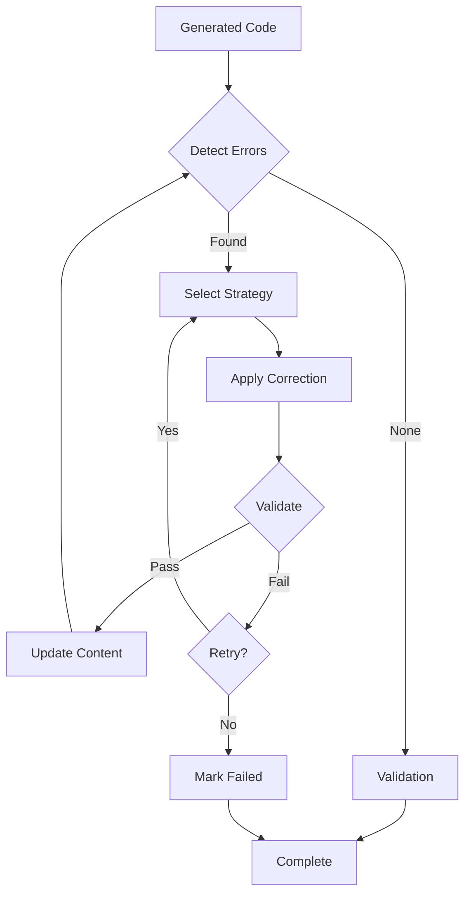
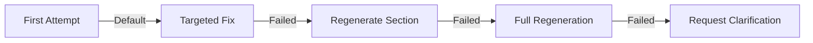

# Sidekick v0.9.4 Changelog — Self-Correction

> **Release Date:** 2026-02-06  
> **Phase:** Advanced Agent Capabilities (v0.9.x)

---

## Summary

This release adds **Self-Correction** — automatic error detection and recovery for agent output.

---

## New Features

### 🔍 Error Types (15)

| Type | Description | Default Strategy |
|------|-------------|------------------|
| `SYNTAX_ERROR` | Invalid code syntax | Regenerate Section |
| `LOGIC_ERROR` | Incorrect logic | Targeted Fix |
| `TYPE_ERROR` | Type mismatch | Targeted Fix |
| `MISSING_IMPORT` | Missing import | Add Missing |
| `UNDEFINED_REFERENCE` | Undefined reference | Targeted Fix |
| `API_MISUSE` | Incorrect API usage | Regenerate Section |
| `HALLUCINATION` | Fabricated information | Full Regeneration |
| `SECURITY_ISSUE` | Security vulnerability | Targeted Fix |
| `PERFORMANCE_ISSUE` | Inefficient code | Targeted Fix |
| `STYLE_VIOLATION` | Style violation | Targeted Fix |
| `INCOMPLETE_RESPONSE` | Truncated response | Continue Generation |
| `CONTEXT_MISMATCH` | Doesn't match context | Regenerate with Context |
| `TEST_FAILURE` | Fails tests | Iterative Refinement |
| `BUILD_FAILURE` | Won't compile | Iterative Refinement |
| `RUNTIME_ERROR` | Runtime exception | Targeted Fix |

### ⚠️ Error Severity (5)

| Severity | Priority | Requires Correction |
|----------|----------|---------------------|
| `CRITICAL` | 4 | ✅ |
| `HIGH` | 3 | ✅ |
| `MEDIUM` | 2 | ❌ |
| `LOW` | 1 | ❌ |
| `INFO` | 0 | ❌ |

### 🔧 Correction Strategies (10)

| Strategy | Cost | Description |
|----------|------|-------------|
| `TARGETED_FIX` | 1 | Fix specific error only |
| `ADD_MISSING` | 1 | Add missing elements |
| `ROLLBACK` | 1 | Revert to previous version |
| `CONTINUE_GENERATION` | 2 | Continue from cutoff |
| `REQUEST_CLARIFICATION` | 2 | Ask user for info |
| `REGENERATE_SECTION` | 3 | Regenerate affected section |
| `REGENERATE_WITH_CONTEXT` | 3 | Regenerate with better context |
| `ITERATIVE_REFINEMENT` | 4 | Test-fix cycle |
| `FULL_REGENERATION` | 5 | Complete regeneration |
| `SKIP` | 0 | Skip correction |

---

## Components Added

### Models (`CorrectionModels.kt`)

| Type | Description |
|------|-------------|
| `DetectedError` | Error with type, severity, location, suggested fix |
| `ErrorType` | 15 error types with default strategies |
| `ErrorSeverity` | 5 severity levels |
| `ErrorLocation` | File, line, column location |
| `CorrectionStrategy` | 10 correction strategies |
| `CorrectionAttempt` | Attempt with status, result |
| `CorrectionStatus` | Pending, InProgress, Succeeded, Failed |
| `ValidationResult` | Validation with checks |
| `ValidationCheck` | Individual check result |
| `ValidationCategory` | Syntax, Types, Security, etc. |
| `CorrectionSession` | Session tracking errors and attempts |
| `CorrectionConfig` | Max attempts, thresholds |
| `CorrectionEvent` | Session lifecycle events |
| `CorrectionResult` | Final result with stats |

### Service (`SelfCorrectionService.kt`)

| Method | Description |
|--------|-------------|
| `createSession()` | Create correction session |
| `detectErrors()` | Detect errors in content |
| `correctError()` | Correct single error |
| `correctAllErrors()` | Correct all errors in session |
| `iterativeCorrection()` | Multi-pass correction |
| `validateCorrection()` | Validate corrected content |
| `validateContent()` | Full content validation |
| `suggestStrategy()` | Suggest best strategy |
| `getStrategiesForError()` | Get available strategies |

---

## Files Changed

### New Files
- `src/main/kotlin/com/sidekick/agent/correction/CorrectionModels.kt`
- `src/main/kotlin/com/sidekick/agent/correction/SelfCorrectionService.kt`
- `src/test/kotlin/com/sidekick/agent/correction/CorrectionModelsTest.kt`
- `src/test/kotlin/com/sidekick/agent/correction/SelfCorrectionServiceTest.kt`

---

## Test Coverage

| Test Class | Tests | Coverage |
|------------|-------|----------|
| `CorrectionModelsTest` | 30+ | Errors, strategies, sessions, validation |
| `SelfCorrectionServiceTest` | 30+ | Detection, correction, events |

---

## API Reference

### Basic Error Detection
```kotlin
val service = SelfCorrectionService()

// Detect errors in generated code
val errors = service.detectErrors(generatedCode)

errors.forEach { error ->
    println("${error.severity}: ${error.type.displayName}")
    println("  ${error.description}")
    error.suggestedFix?.let { println("  Fix: $it") }
}
```

### Automatic Correction
```kotlin
// Create a correction session
val session = service.createSession(taskId = "task-123")

// Detect and add errors to session
service.detectErrors(generatedCode, sessionId = session.id)

// Correct all errors
val result = service.correctAllErrors(session.id, generatedCode)

if (result.success) {
    println("All errors corrected!")
    println("Final code:\n${result.finalContent}")
} else {
    println("${result.remainingErrors.size} errors remain")
}
```

### Iterative Correction
```kotlin
// Run multiple detection-correction passes
val result = service.iterativeCorrection(
    taskId = "task-123",
    content = generatedCode,
    maxIterations = 3
)

println("Correction rate: ${result.correctionRate * 100}%")
println("Total attempts: ${result.totalAttempts}")
println("Duration: ${result.durationMs}ms")
```

### Strategy Selection
```kotlin
// Get best strategy for an error
val error = DetectedError.syntax("Missing semicolon")
val strategy = service.suggestStrategy(error, previousAttempts = 0)
// Returns: TARGETED_FIX

// After failure, escalate
val escalated = service.suggestStrategy(error, previousAttempts = 2)
// Returns: FULL_REGENERATION

// Get all available strategies for error type
val options = service.getStrategiesForError(ErrorType.HALLUCINATION)
// Returns: [FULL_REGENERATION, REGENERATE_WITH_CONTEXT]
```

### Custom Configuration
```kotlin
val config = CorrectionConfig(
    maxAttempts = 10,
    maxAttemptsPerError = 3,
    autoCorrectThreshold = 0.9f,
    enableIterativeRefinement = true,
    validateAfterCorrection = true,
    runTestsOnCorrection = true,
    rollbackOnFailure = true
)

val session = service.createSession("task-123", config)
```

---

## Detection Patterns

The service automatically detects:

### Syntax Issues
- Unbalanced braces `{ }`
- Unbalanced parentheses `( )`
- Common error message patterns

### Security Issues
- SQL injection (string concatenation in queries)
- Hardcoded credentials (password, api_key, secret)

### Hallucinations
- References to nonexistent APIs
- Suspicious method names (`doMagic`, `autoSolve`)

### Incomplete Responses
- Truncation markers (`...`, `…`)
- Unclosed code blocks
- Excessive TODO markers

---

## Correction Flow



---

## Strategy Escalation



---

## Verification

```bash
./gradlew test --tests "com.sidekick.agent.correction.*"
# All tests passing
```
