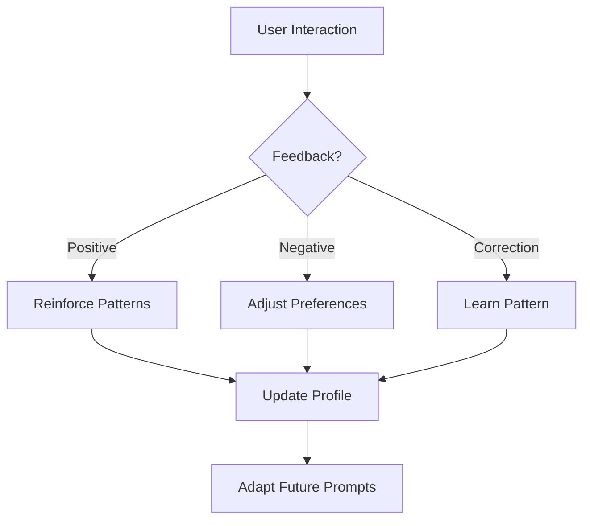

# Sidekick v0.9.5 Changelog — User Preferences

> **Release Date:** 2026-02-06  
> **Phase:** Advanced Agent Capabilities (v0.9.x)

---

## Summary

This release adds **User Preferences** — style learning and adaptive personalization.

---

## New Features

### 👤 User Profiles

| Field | Description |
|-------|-------------|
| `codingStyle` | Coding style preferences |
| `communicationStyle` | Communication preferences |
| `workflowPreferences` | Workflow preferences |
| `feedbackHistory` | History of user feedback |
| `learnedPatterns` | Patterns learned from interactions |

### 📝 Coding Style Preferences

| Preference | Options |
|------------|---------|
| `indentation` | 2 Spaces, 4 Spaces, Tabs |
| `braceStyle` | Same Line (K&R), New Line (Allman) |
| `namingConvention` | camelCase, PascalCase, snake_case, SCREAMING_SNAKE |
| `documentationStyle` | KDoc, Javadoc, JSDoc, Minimal, None |
| `preferImmutability` | true/false |
| `preferFunctionalStyle` | true/false |
| `maxLineLength` | 80-200 |

### 💬 Communication Preferences

| Setting | Options |
|---------|---------|
| `verbosity` | Terse, Concise, Balanced, Detailed, Comprehensive |
| `tone` | Casual, Professional, Formal, Friendly, Technical, Educational |
| `explanationDepth` | Brief, Moderate, Comprehensive, Tutorial |
| `codeCommentLevel` | None, Minimal, Moderate, Extensive |

### 📊 Feedback Categories (9)

| Category | Description |
|----------|-------------|
| `CODE_QUALITY` | Code quality feedback |
| `CODE_STYLE` | Style/formatting feedback |
| `EXPLANATION` | Explanation quality |
| `ACCURACY` | Correctness feedback |
| `COMPLETENESS` | Completeness feedback |
| `SPEED` | Response time |
| `RELEVANCE` | Task relevance |
| `USABILITY` | Ease of use |
| `OTHER` | Other feedback |

### 🧠 Learned Pattern Types (9)

| Type | Description |
|------|-------------|
| `CODE_STYLE` | Code formatting patterns |
| `NAMING_CONVENTION` | Naming preferences |
| `IMPORT_ORDER` | Import organization |
| `COMMENT_STYLE` | Comment preferences |
| `ERROR_HANDLING` | Error handling patterns |
| `TESTING_PATTERN` | Test structure preferences |
| `ARCHITECTURE` | Architectural patterns |
| `PREFERENCE` | General preferences |
| `CUSTOM` | Custom patterns |

---

## Components Added

### Models (`PreferenceModels.kt`)

| Type | Description |
|------|-------------|
| `UserProfile` | Profile with all preferences |
| `CodingStylePreferences` | Code style settings |
| `CommunicationPreferences` | Communication settings |
| `WorkflowPreferences` | Workflow settings |
| `FeedbackEntry` | Feedback with sentiment/category |
| `LearnedPattern` | Pattern with confidence |
| `PreferenceEvent` | Profile lifecycle events |
| `AdaptedPrompt` | Prompt with applied preferences |

### Service (`PreferenceService.kt`)

| Method | Description |
|--------|-------------|
| `getOrCreateProfile()` | Get or create user profile |
| `updateCodingStyle()` | Update coding preferences |
| `updateCommunicationStyle()` | Update communication preferences |
| `inferCodingStyle()` | Infer style from code sample |
| `recordFeedback()` | Record user feedback |
| `learnPattern()` | Learn pattern from correction |
| `learnStyleCorrection()` | Learn from before/after |
| `adaptPrompt()` | Adapt prompt with preferences |
| `adjustVerbosity()` | Adjust verbosity level |

---

## Files Changed

### New Files
- `src/main/kotlin/com/sidekick/agent/preferences/PreferenceModels.kt`
- `src/main/kotlin/com/sidekick/agent/preferences/PreferenceService.kt`
- `src/test/kotlin/com/sidekick/agent/preferences/PreferenceModelsTest.kt`
- `src/test/kotlin/com/sidekick/agent/preferences/PreferenceServiceTest.kt`

---

## Test Coverage

| Test Class | Tests | Coverage |
|------------|-------|----------|
| `PreferenceModelsTest` | 30+ | Profiles, styles, feedback, patterns |
| `PreferenceServiceTest` | 30+ | Profiles, learning, adaptation |

---

## API Reference

### Profile Management
```kotlin
val service = PreferenceService()

// Get or create profile
val profile = service.getOrCreateProfile("user123")

// Update coding style
service.updateCodingStyle("user123", CodingStylePreferences(
    language = "kotlin",
    indentation = IndentationStyle.SPACES_4,
    preferImmutability = true,
    preferFunctionalStyle = true
))

// Update communication style
service.updateCommunicationStyle("user123", CommunicationPreferences(
    verbosity = VerbosityLevel.CONCISE,
    tone = ToneStyle.PROFESSIONAL
))
```

### Style Inference
```kotlin
// Learn style from existing code
val userCode = """
    fun calculateTotal(items: List<Item>): Double {
        return items.sumOf { it.price }
    }
""".trimIndent()

val inferredStyle = service.inferCodingStyle(userCode)
println("Detected: ${inferredStyle.indentation.displayName}")
println("Naming: ${inferredStyle.namingConvention.displayName}")

// Apply to profile
service.updateCodingStyle("user123", inferredStyle)
```

### Feedback Recording
```kotlin
// Record positive feedback
service.recordPositiveFeedback(
    userId = "user123",
    taskType = "refactor",
    category = FeedbackCategory.CODE_QUALITY,
    comment = "Clean and readable!"
)

// Record negative feedback (triggers auto-adjustments)
service.recordNegativeFeedback(
    userId = "user123",
    taskType = "explanation",
    category = FeedbackCategory.EXPLANATION,
    comment = "Too verbose, just give me the code"
)
// Auto-decreases verbosity setting
```

### Pattern Learning
```kotlin
// Learn from user correction
service.learnStyleCorrection(
    userId = "user123",
    original = "var count = 0",
    corrected = "val count = 0"
)

// Learn custom pattern
service.learnPattern(
    userId = "user123",
    type = PatternType.NAMING_CONVENTION,
    pattern = "getData",
    replacement = "fetchData",
    example = "getData() -> fetchData()"
)

// Patterns are reinforced with each occurrence
// High-confidence patterns are included in prompts
```

### Prompt Adaptation
```kotlin
// Adapt prompt based on user preferences
val basePrompt = "Write a function to sort a list"
val adapted = service.adaptPrompt("user123", basePrompt)

println(adapted.adaptedPrompt)
// Includes:
// - Coding style guide
// - Verbosity instruction
// - Tone preference
// - High-confidence patterns as rules

println("Applied: ${adapted.appliedPreferences}")
// ["coding_style", "verbosity", "tone", "learned_patterns"]
```

---

## Learning Flow



---

## Verification

```bash
./gradlew test --tests "com.sidekick.agent.preferences.*"
# All tests passing
```
