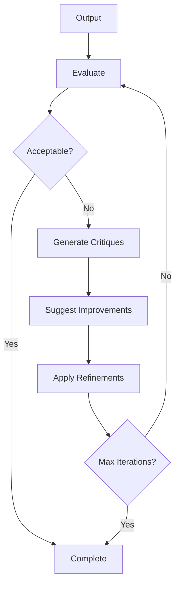

# Sidekick v0.9.6 Changelog — Reflection & Critique

> **Release Date:** 2026-02-06  
> **Phase:** Advanced Agent Capabilities (v0.9.x)

---

## Summary

This release adds **Reflection & Critique** — self-evaluation loops for quality improvement.

---

## New Features

### 📊 Quality Dimensions (12)

| Dimension | Weight | Description |
|-----------|--------|-------------|
| `CORRECTNESS` | 1.5x | Factual correctness |
| `RELEVANCE` | 1.3x | Task relevance |
| `COMPLETENESS` | 1.2x | Full response |
| `SECURITY` | 1.2x | Security best practices |
| `BEST_PRACTICES` | 1.0x | Industry standards |
| `ROBUSTNESS` | 1.0x | Error handling |
| `CLARITY` | 1.0x | Readability |
| `MAINTAINABILITY` | 0.9x | Code maintainability |
| `EFFICIENCY` | 0.8x | Performance |
| `TESTABILITY` | 0.7x | Test-friendliness |
| `DOCUMENTATION` | 0.6x | Documentation quality |
| `STYLE` | 0.5x | Formatting |

### ⚠️ Critique Severities (5)

| Severity | Requires Action | Icon |
|----------|-----------------|------|
| `CRITICAL` | ✅ | 🔴 |
| `MAJOR` | ✅ | 🟠 |
| `MINOR` | ❌ | 🟡 |
| `SUGGESTION` | ❌ | 💡 |
| `PRAISE` | ❌ | ✨ |

### 🔧 Improvement Types (12)

| Type | Description |
|------|-------------|
| `REFACTORING` | Code restructuring |
| `SIMPLIFICATION` | Reduce complexity |
| `OPTIMIZATION` | Performance improvement |
| `ERROR_HANDLING` | Better error handling |
| `VALIDATION` | Input validation |
| `DOCUMENTATION` | Add/improve docs |
| `TESTING` | Improve testability |
| `SECURITY` | Security fixes |
| `NAMING` | Better names |
| `STRUCTURE` | Code organization |
| `STYLE` | Formatting |
| `OTHER` | Other improvements |

---

## Components Added

### Models (`ReflectionModels.kt`)

| Type | Description |
|------|-------------|
| `Reflection` | Self-evaluation of output |
| `OutputType` | Code, Explanation, Plan, etc. |
| `QualityEvaluation` | Multi-dimensional scores |
| `QualityDimension` | 12 evaluation dimensions |
| `Critique` | Specific issue with suggestion |
| `CritiqueSeverity` | Critical, Major, Minor, etc. |
| `Improvement` | Suggested improvement |
| `ImprovementType` | 12 improvement types |
| `ReflectionSession` | Session tracking reflections |
| `ReflectionEvent` | Lifecycle events |
| `ReflectionResult` | Final reflection result |

### Service (`ReflectionService.kt`)

| Method | Description |
|--------|-------------|
| `evaluate()` | LLM-based quality evaluation |
| `quickEvaluate()` | Heuristic-based evaluation |
| `generateCritiques()` | Generate critiques from evaluation |
| `suggestImprovements()` | Map critiques to improvements |
| `reflect()` | Single reflection pass |
| `iterativeReflect()` | Multi-pass refinement loop |

---

## Files Changed

### New Files
- `src/main/kotlin/com/sidekick/agent/reflection/ReflectionModels.kt`
- `src/main/kotlin/com/sidekick/agent/reflection/ReflectionService.kt`
- `src/test/kotlin/com/sidekick/agent/reflection/ReflectionModelsTest.kt`
- `src/test/kotlin/com/sidekick/agent/reflection/ReflectionServiceTest.kt`

---

## Test Coverage

| Test Class | Tests | Coverage |
|------------|-------|----------|
| `ReflectionModelsTest` | 30+ | Reflections, evaluations, critiques |
| `ReflectionServiceTest` | 30+ | Evaluation, iteration, events |

---

## API Reference

### Quick Evaluation
```kotlin
val service = ReflectionService()

// Quick heuristic evaluation
val eval = service.quickEvaluate(generatedCode, OutputType.CODE)

println("Overall: ${eval.overallScore * 100}%")
println("Weakest: ${eval.weakestDimension?.displayName}")
println("Strengths: ${eval.strengths}")
```

### Single Reflection
```kotlin
// Reflect on output
val reflection = service.reflect(
    taskId = "task-123",
    output = generatedCode,
    outputType = OutputType.CODE
)

if (reflection.needsRefinement) {
    reflection.critiques.forEach { critique ->
        println("${critique.severity.icon} ${critique.issue}")
        critique.suggestion?.let { println("  Fix: $it") }
    }
}
```

### Iterative Refinement
```kotlin
// Multiple passes until acceptable
val result = service.iterativeReflect(
    taskId = "task-123",
    output = generatedCode,
    outputType = OutputType.CODE,
    maxIterations = 3
)

println("Initial: ${result.initialScore * 100}%")
println("Final: ${result.finalScore * 100}%")
println("Improvement: +${result.improvementPercentage}%")
println("Iterations: ${result.totalIterations}")
```

### Custom Configuration
```kotlin
val config = ReflectionConfig(
    maxIterations = 5,
    minAcceptableScore = 0.7f,
    targetScore = 0.9f,
    enableAutoRefinement = true,
    stopOnAcceptable = true
)

val session = service.createSession("task-123", config)
```

---

## Evaluation Flow



---

## Verification

```bash
./gradlew test --tests "com.sidekick.agent.reflection.*"
# All tests passing
```
